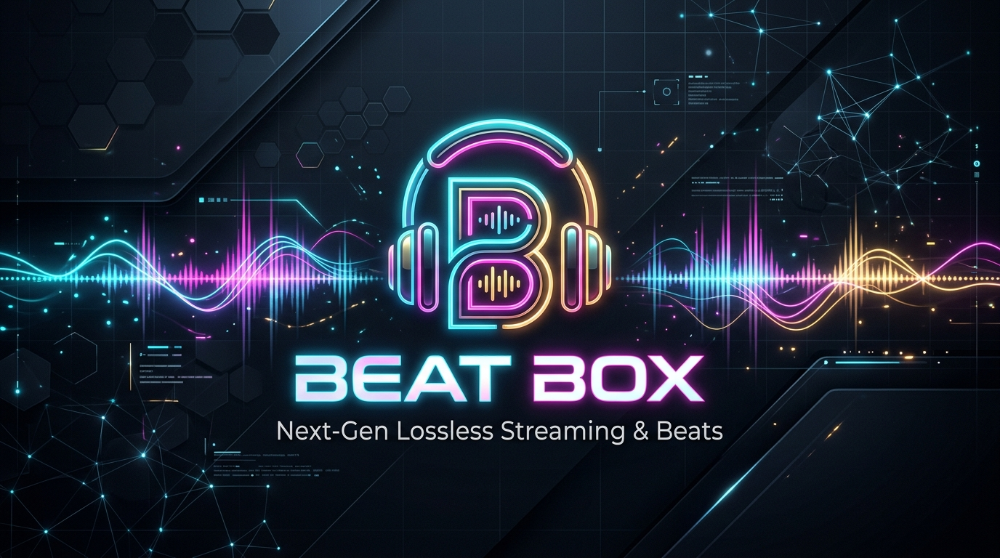
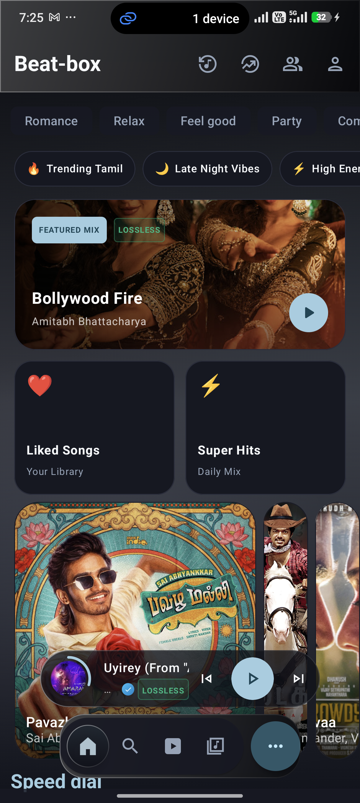
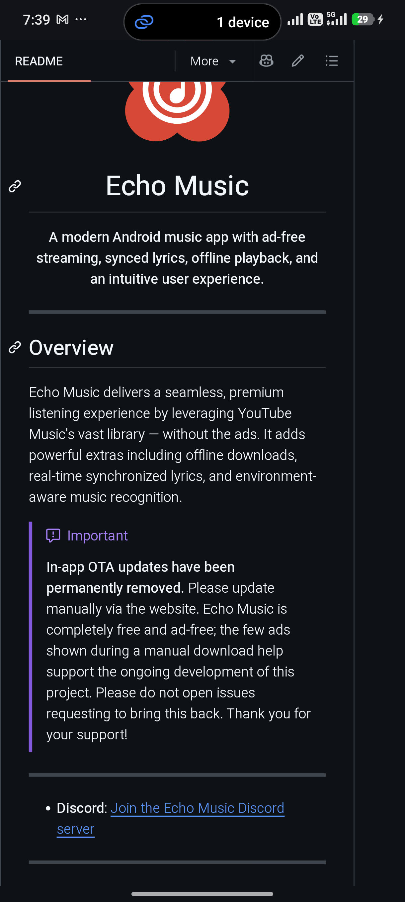
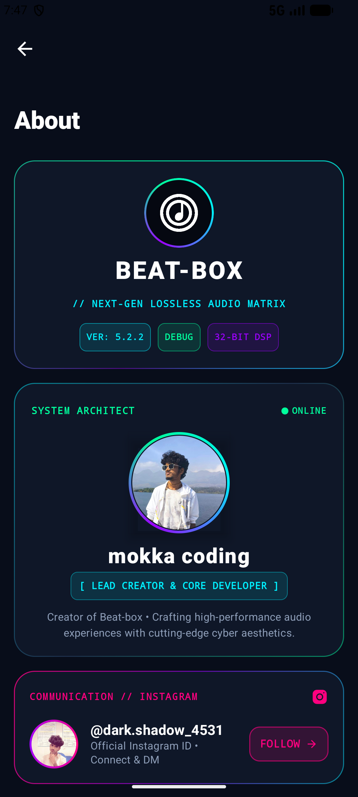
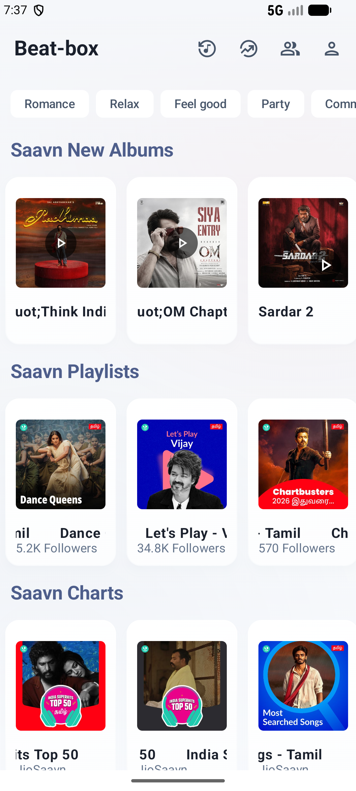
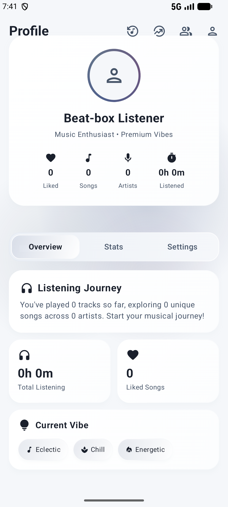

<div align="center">

  

  <br/><br/>

  <p align="center">
    <a href="LICENSE"></a>
    <a href="https://developer.android.com"></a>
    <a href="https://kotlinlang.org"></a>
    <a href="https://developer.android.com/jetpack/compose"></a>
    <a href="#axion-studio-dsp--equalizer"></a>
    <a href="#ai-voice-assistant--smart-recommendations"></a>
  </p>

  <p><strong>The ultimate next-generation Android music streaming application featuring Lossless Audio, Beats Video Feed, AI Voice Assistant, Axion Studio DSP, and a futuristic Cyber-Glass UI.</strong></p>

</div>

---

## 🎧 Overview

**Beat Box** is a hyper-modern, open-source Android music streaming experience crafted for audiophiles, tech enthusiasts, and everyday listeners. Powered by dual catalogs (**YouTube Music** and **JioSaavn Hi-Res Lossless FLAC**), Beat Box elevates music discovery into an art form with intelligent AI recommendations, vertical video reels, tactile hardware equalizer simulation, and a breathtaking 2026 Liquid Glass & Cyberpunk user interface.

---

## 📸 Screenshots Showcase

<div align="center">
  <table>
    <tr>
      <td align="center" width="33%">
        
        <br/><br/>
        <b>🚀 Welcome & Setup</b>
        <br/>
        <sub>Cyberpunk onboarding & theme customization</sub>
      </td>
      <td align="center" width="33%">
        
        <br/><br/>
        <b>🔥 Dynamic Home Feed</b>
        <br/>
        <sub>Live queue bar, trending charts & curated chips</sub>
      </td>
      <td align="center" width="33%">
        
        <br/><br/>
        <b>💎 Cyber Brand Experience</b>
        <br/>
        <sub>Next-gen aesthetics & system telemetry</sub>
      </td>
    </tr>
    <tr>
      <td align="center" width="33%">
        
        <br/><br/>
        <b>🎵 Smart Discovery Feed</b>
        <br/>
        <sub>AI-curated mixes, moods & daily playlists</sub>
      </td>
      <td align="center" width="33%">
        
        <br/><br/>
        <b>📊 Audiophile Profile</b>
        <br/>
        <sub>Listening habits, top artists & history metrics</sub>
      </td>
      <td align="center" width="33%">
        
        <br/><br/>
        <b>⚡ Beat Box Identity</b>
        <br/>
        <sub>Uncompromising sonic fidelity & beauty</sub>
      </td>
    </tr>
  </table>
</div>

---

## ⚡ Key Highlights & Core Features

### 🎵 Dual-Catalog Engine & Hi-Res Lossless Audio
- **Multi-Source Streaming**: Seamless aggregation from both **YouTube Music** and **JioSaavn**, offering an unmatched global library.
- **Lossless FLAC & 320kbps**: Experience studio-grade acoustic clarity with automatic 24-bit/16-bit FLAC resolution.
- **Ad-Free Continuous Playback**: Absolutely zero advertisements, interruptions, or sponsored promotions.
- **Background & Lock-Screen Playback**: Uninterrupted listening with interactive media controls while screen is off or multitasking.
- **Smart Audio ⇄ Video Toggle**: Flip effortlessly between official 1080p/4K video clips and high-bandwidth audio streams.

### 📱 "Beats" — Vertical Short-Form Video Feed
- **Swipe-Up Music Reels**: Discover new releases, viral tracks, and artist visuals in a lightning-fast vertical video feed.
- **Direct Song Transitions**: Tap to instantly jump from any Beat snippet into full song streaming, album queue, or artist radio.

### 🤖 AI Voice Assistant & Beat Box Neural Brain
- **Voice Assistant Orb**: Hands-free voice recognition allowing you to command *"Play phonk workout playlist"*, *"Find tracks like this"*, or *"Skip to drop"*.
- **Interactive AI Chat Concierge**: Talk to the built-in AI concierge to discover music by mood, generate dynamic playlists, and explore sonic trivia.
- **Beat Box Brain**: Dynamic recommendation engine that understands your listening personality and generates hyper-personalized "Made for You" daily mixes.

### 🎛️ Axion Studio DSP & Equalizer Hardware Emulation
- **10-Band Parametric Equalizer**: Surgical acoustic frequency control calibrated for premium IEMs, planar magnetic headphones, and external DACs.
- **Rotary Studio Knobs**: Realistic, tactile analog rotary dials with haptics for **Bass Boost**, **Treble Clarity**, **Soundstage Widening**, and **Air Extension**.
- **Engineered Acoustic Profiles**: Beat Box Signature, Spatial Audio / Atmos emulation, Bass Reflex, and customizable user profiles.

### 🎨 2026 Liquid Glass & Cyberpunk Design
- **Frosted Glassmorphism**: Translucent floating glass navigation, dynamic blur shaders, and neon border glow accents.
- **Real-Time Waveform Scrubber**: Interactive visual waveform that responds directly to audio playback amplitude.
- **Gooey Fluid Wave Visualizer**: Organic liquid wave animations dancing along with the low-end frequencies.
- **Dynamic Adaptive Theming**: Palettes automatically extract and morph based on the album art of the currently playing track.

### 🎬 Synchronized Dynamic Lyrics & Animated Canvases
- **Word-by-Word & Syllable Sync**: Ultra-precise karaoke lyric tracking synchronized to vocal performance.
- **Multi-Engine Lyrics Fallback**: Aggregates through **Apple Music**, **LRCLIB**, **Paxsenix**, and **BetterLyrics**.
- **Live Translation**: On-the-fly lyrics translation across dozens of international languages.
- **Looping Video Backdrops**: Support for **Apple Music Canvas** and **Spotify Canvas** video art.

### 📥 High-Speed Offline Downloads & Local Playback
- **Full Library Offline**: Download singles, full albums, and playlists with embedded high-resolution artwork and metadata tags.
- **Local Device Audio**: Seamlessly import and play your existing on-device `.flac`, `.wav`, `.mp3`, and `.m4a` music files.

### 🌐 Social Jam, Discord & Community Scrobbling
- **Listen Together**: Host or join synchronized playback rooms with friends over low-latency WebSockets.
- **Discord Rich Presence**: Live playback status, elapsed track time, and album art directly in Discord.
- **Last.fm & ListenBrainz**: Instant real-time scrobbling and playback statistics tracking.
- **Music Fingerprinting**: Built-in sound identifier to recognize songs playing in your physical surroundings.

---

## 🛠️ Architecture & Tech Stack

```
Beat Box Architecture
├── UI Layer (Jetpack Compose, Liquid Glass, Cyber Shaders)
├── State & Presentation (Kotlin Coroutines, StateFlow, AndroidX ViewModel)
├── Audio Engine (AndroidX Media3 ExoPlayer, Custom 32-bit DSP Sink)
├── Media Decoders & Resolvers (InnerTube, JioSaavn Media API, Spotify Canvas)
├── Database & Cache (Room DB, SQLite, DataStore Preferences)
└── Networking (OkHttp3, Ktor, WebSocket Client)
```

| Component | Technology / Library |
| :--- | :--- |
| **Language** | Kotlin 2.1 (Java 17 Toolchain) |
| **UI Framework** | Jetpack Compose + Material 3 |
| **Audio Core** | AndroidX Media3 (ExoPlayer 1.5+) |
| **Database** | Room ORM + SQLite |
| **Dependency Injection** | Hilt |
| **Image Loading** | Coil 3 |
| **Network & APIs** | OkHttp 4, Ktor Client, JSON Scrapers |
| **Async & Reactive** | Kotlin Coroutines & Flow |

---

## 🚀 Getting Started & Building from Source

### Prerequisites
- **Android Studio**: Ladybug / Meerkat (or newer)
- **JDK**: JDK 17 (Microsoft HotSpot or OpenJDK)
- **Android SDK**: API 35 (Android 15) with minimum API 26 (Android 8.0)

### Quick Build Steps

1. **Clone the repository**:
   ```bash
   git clone https://github.com/keerthan4531-a11y/beat-box-Alpha-Alpha.git
   cd beat-box
   ```

2. **Open the project in Android Studio** or build directly via CLI:
   ```bash
   # Windows PowerShell:
   .\gradlew.bat :app:assembleArm64FossDebug

   # Linux / macOS:
   ./gradlew :app:assembleArm64FossDebug
   ```

3. **Install the APK on your device or emulator**:
   ```bash
   adb install -r app/build/outputs/apk/arm64Foss/debug/app-arm64-foss-debug.apk
   ```

---

## 📜 License

Beat Box is distributed under the **GNU General Public License v3.0 (GPL-3.0)**.
You are free to view, study, modify, and build upon this code according to the license terms. See the [LICENSE](LICENSE) file for the full text.

---

<div align="center">
  <b>Beat Box</b> • Engineered with passion for music lovers worldwide.<br/>
  <sub>© 2026 Beat Box Development Team. All rights reserved.</sub>
</div>
